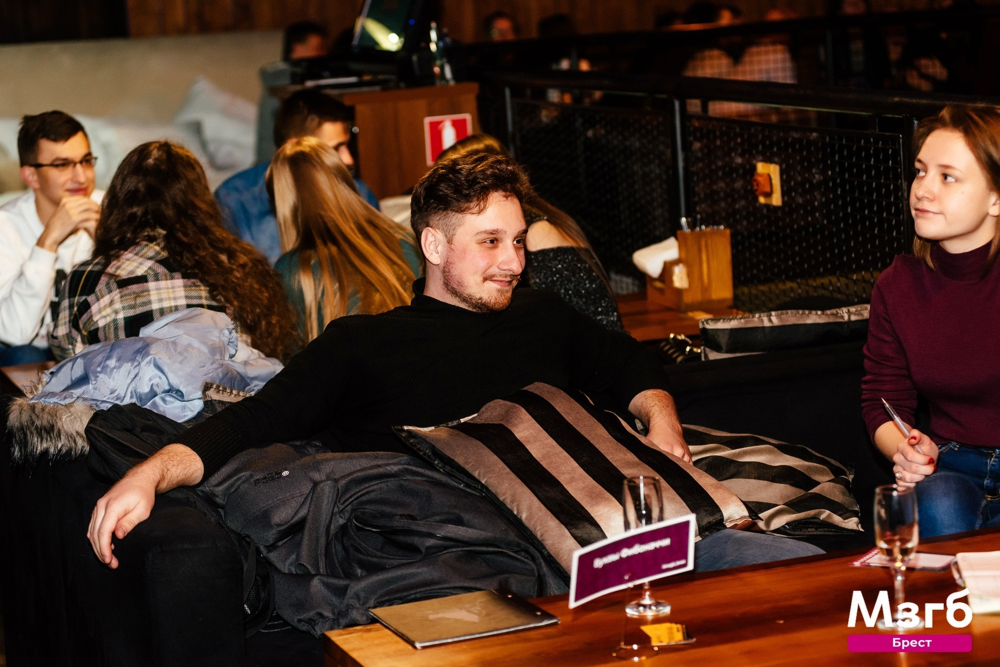

<header style="display: flex; flex-direction: row; justify-content: flex-start; align-items: center; margin-bottom: 3em;">

    
Kiryl

    
<strong>Siamak</strong>

</header>

## Contacts Info

- Cell: +375(25)760-78-79
- Email: [OberstKakerlak@yandex.by](mailto:OberstKakerlak@yandex.by)
- Telegram: [https://t.me/KirillSemak](https://t.me/KirillSemak)
- Github: [https://github.com/Seppiq](https://github.com/Seppiq)

&#8194;

## About me

I have good interpersonal skills, am an excellent team worker and very willing to learn and develop new skills. 
I am reliable and dependable and often seek new responsibilities within a wide range of employment areas.I like to get new knowledge and information. 
I want to fully learn Java, and Spring framework, and finally become a Junior Backend Developer, improve my professional skills and find a job.
&#8194;

**Technologies:**

- Back-end: Spring(Boot, Data and etc.);
- Front-end: React(in process), HTML, CSS;

## Additional Information

**_English Level_** – Pre-Intermediate (A2)

&#8194;
